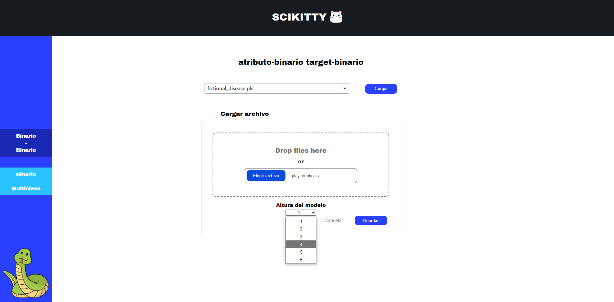
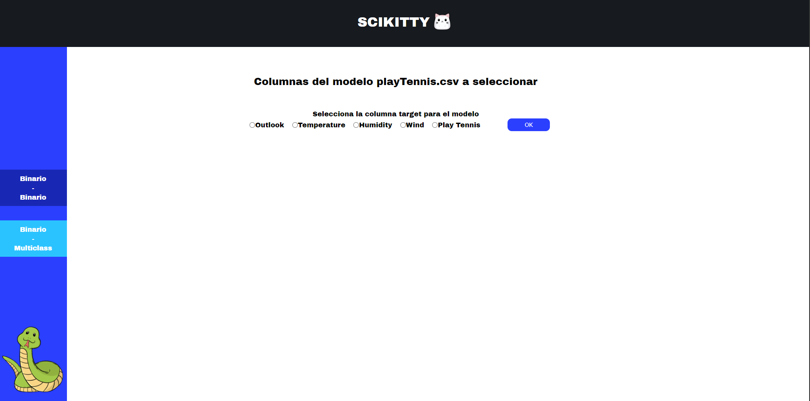
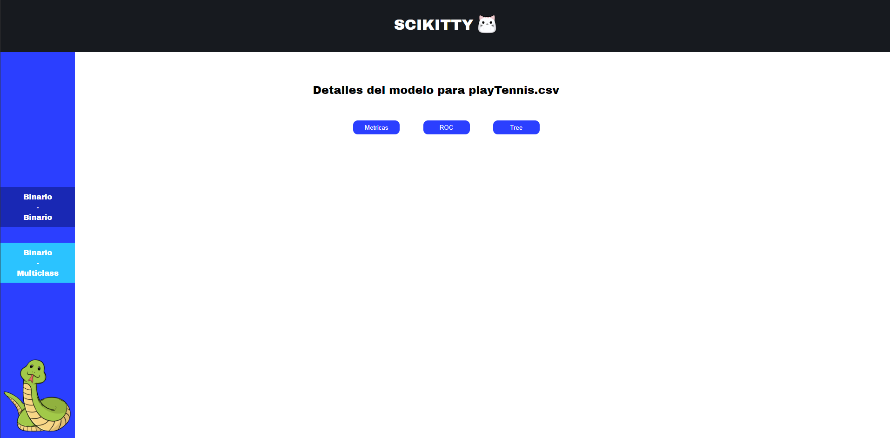
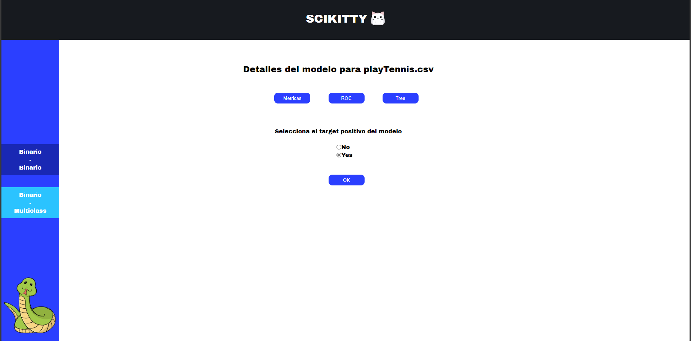
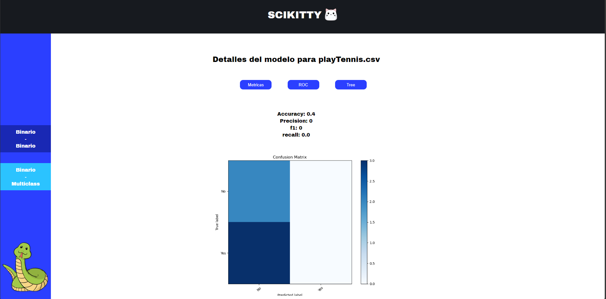
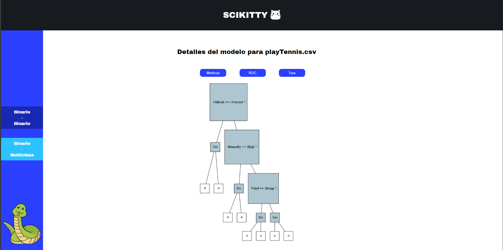

## Integrantes:
Nicole Araya Ballestero | Esteban Mojica Gonzalez | Daniel Ramirez Calvo | Ariana Solano Vallejos 
##
Scikitty IA - 2024
UNA

<details>
 <summary>Imagenes del sitio web</summary>

 
 
 
 
 
 
</details>

# Descarga

Se descarga la aplicación del drive del profesor en formato zip

## Instalación

Una vez descargado el zip se descomprime

Abrimos el Anaconda Prompt en donde se hizo la debida descompresión del proyecto

Entramos en la carpeta del proyecto con el comando

```
cd EIF420O-I-2024-SciKitty-P1-NicoleArayaBallestero-04-01pm
```

Seguidamente se deben instalar todas las dependencias que necesita la aplicación para funcionar con:

```
 .\pip_install.bat
```

## Ejecución de pruebas con demos Decision Tree Classifier

Para ejecutar los demos de Decision Tree Classifier, utilizaremos el ejecutable:

```
 .\run_scripts.bat
```

## Ejecución de pruebas con demos Tree Gradient Boosting

Para ejecutar los demos de Tree Gradient Boosting, utilizaremos el ejecutable:

```
 .\run_tb_scripts.bat
```

## Ejecución del sitio web

Para ejecutar el sitio web utilizaremos el siguiente ejecutable:

```
 .\run_web.bat
```

Y ejecutar el servidor python de scikitty, en otra prompt, sera el siguiente ejecutable:

```
 .\run_server.bat
```
